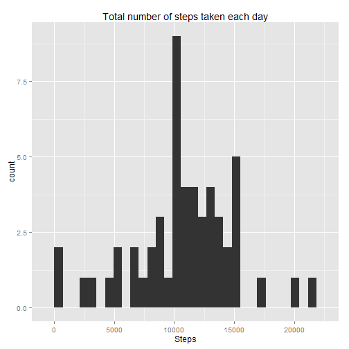
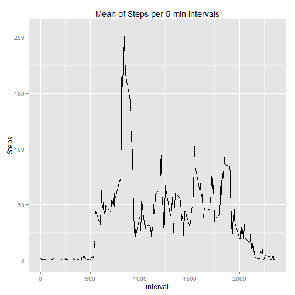
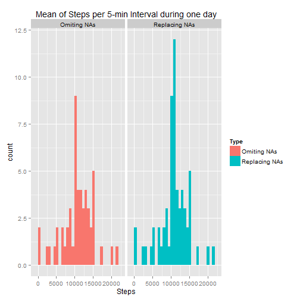
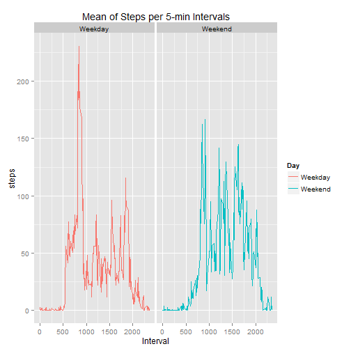

# First Assignment - Reproducibility Research - Datascience - July 2015

## Introduction

It is now possible to collect a large amount of data about personal movement using activity monitoring devices such as a Fitbit, Nike Fuelband, or Jawbone Up. These type of devices are part of the "quantified self" movement - a group of enthusiasts who take measurements about themselves regularly to improve their health, to find patterns in their behavior, or because they are tech geeks. But these data remain under-utilized both because the raw data are hard to obtain and there is a lack of statistical methods and software for processing and interpreting the data.

This assignment makes use of data from a personal activity monitoring device. This device collects data at 5 minute intervals through out the day. The data consists of two months of data from an anonymous individual collected during the months of October and November, 2012 and include the number of steps taken in 5 minute intervals each day.

## Data

The data for this assignment can be downloaded from the course web site:

Dataset: Activity monitoring data [52K]
The variables included in this dataset are:

* steps: Number of steps taking in a 5-minute interval (missing values are coded as NA)

* date: The date on which the measurement was taken in YYYY-MM-DD format

* interval: Identifier for the 5-minute interval in which measurement was taken

The dataset is stored in a comma-separated-value (CSV) file and there are a total of 17,568 observations in this dataset.

## Loading and preprocessing the data.

- Load the data:


```r
# Load csv file #
dataNA <- read.csv("./activity.csv")
```

```
## Warning in file(file, "rt"): cannot open file './activity.csv': No such
## file or directory
```

```
## Error in file(file, "rt"): cannot open the connection
```


- Omit the NA values in the data:


```r
# Omit NAs values #
data <- na.omit(dataNA)
```

## What is mean total number of steps taken per day?

- Total number of steps taken per day: 


```r
library(plyr)

# Summarise the dataframe "data" by date #
cdata <- ddply(data, c("date"), summarise, Steps = sum(steps))
head(cdata)
```

```
##         date Steps
## 1 2012-10-02   126
## 2 2012-10-03 11352
## 3 2012-10-04 12116
## 4 2012-10-05 13294
## 5 2012-10-06 15420
## 6 2012-10-07 11015
```

- Histogram of the total number of steps taken each day.


```r
library(ggplot2)

qplot(Steps, data=cdata, geom="histogram", main = "Total number of steps taken each day")
```

 

- Mean and median of the total number of steps taken per day.


```r
mean = mean(cdata$Steps)
median = median(cdata$Steps)
```
The mean of the total number of steps taken per day is 1.0766189 &times; 10<sup>4</sup> and the median is 10765.

## What is the average daily activity pattern?

- Time series plot (i.e. type = "l") of the 5-minute interval (x-axis) and the average number of steps taken, averaged across all days (y-axis).


```r
# Building dataframe "TimeSeries" that contains the 288 intervals of 5min per day, for all the day which data is available #

TimeSeries <- ddply(data, c("interval"), summarise, Steps = mean(steps))

# Plot #
qplot(interval, Steps, data=TimeSeries, geom = "line", main = "Mean of Steps per 5-min Intervals")
```

 

- 5-minute Interval, on average across all the days in the dataset, which contains the maximum number of steps:


```r
# Creates a vector with the location of the maximum value of Steps.#
MaxIndex = which.max(TimeSeries$Steps)

# Get the maximun value of steps #
Max = TimeSeries[MaxIndex,1]
```
Interval : 835


## Imputing missing values

- Total number of missing values in the dataset.

```r
sum = sum(is.na(dataNA$steps))
```
The total number of missing values is 2304

- Strategy to filling in all of the missing values in the dataset: 

  - Get the position row of each NA (NAindex), 
  - use this index to locate the media 5-min Interval that corresponds to the interval with the missing value and,
  - replace the missing values in the interval with the average number of steps of the 5-min Interval calculated from the dataframe "TimeSeries" that was built above.

- Create a new dataset that is equal to the original dataset but with the missing data filled in.


```r
# Obtain the position where the NA are locate. #

NAindex = which(is.na(dataNA$steps))

# Create a new dataframe and replace the NA values with average number of steps for each interval(288 per day) of 5 min during the day #

datafilled = dataNA

for (x in 1:2304){
    y = NAindex[x]
    Interval = datafilled[y, 3]
    Intervalindex = which (TimeSeries$interval == Interval) 
    datafilled[y,1] = TimeSeries[Intervalindex,2]
}
```

- Histogram of the total number of steps taken each day


```r
# Create a new dataframe with data from both data without the NAs values and the data with NA replaced. #

cfdata <- ddply(datafilled, c("date"), summarise, Steps = sum(steps))
cdata[,3]="Omiting NAs"
cfdata[,3]="Replacing NAs"
totaldata= rbind(cdata, cfdata)
colnames(totaldata) = c("Date","Steps","Type")

# Plotting both histogram to compare differences #

qplot(Steps, data= totaldata, facets= ~Type, geom="histogram", fill = Type, main = "Mean of Steps per 5-min Interval during one day")
```

 

- Calculate and report the mean and median total number of steps taken per day.


```r
Fmean = mean(cfdata$Steps)
Fmedian = median(cfdata$Steps)
MeanDifference = 100 * (Fmean - mean)/mean
MedianDifference = 100 * (Fmedian - median)/median
```

The mean of the total number of steps taken per day is 1.0766189 &times; 10<sup>4</sup> and the median is 1.0766189 &times; 10<sup>4</sup>. 
The mean differs from the estimates from the first part of the assignment in 0% and the median in 0.0110421%.


- Impact of imputing missing data on the estimates of the total daily number of steps.


```r
Totalperday = sum(cdata$Steps)
Totalperdayfilled = sum(cfdata$Steps)
Difference = 100 * (Totalperdayfilled - Totalperday)/Totalperday
```

The total daily number of steps calculated after imputing the missing data is 6.5673751 &times; 10<sup>5</sup>, and differs in 15.0943396% respect of the stimates from the data after omitting missing values.

## Are there differences in activity patterns between weekdays and weekends

- Create a new factor variable in the dataset with two levels - "weekday" and "weekend" indicating whether a given date is a weekday or weekend day.


```r
# Assure that the days will be identified in English #

Sys.setlocale("LC_TIME", "English")
```

```
## [1] "English_United States.1252"
```

```r
# Create a new column that identifies which day of the week is each date # 
datafilled[,4] <- weekdays(as.Date(datafilled$date))

# Rename the new column #
colnames(datafilled) = c("Steps", "Date", "Interval", "Day")

# Identify which rows contain contain data from weekends # 
WeekendIndex = which(datafilled$Day %in% c("Sunday","Saturday"))

# Replace the value of the column "Day" with the value = "Weekday" #  
datafilled[,4] = "Weekday"

# Replace the value of the column "Day" with the value = "Weekend" only in the place where the days are Saturday or Sunday as is indicated in the vector "WeekendIndex" # 
datafilled[WeekendIndex,4] = "Weekend"
```

- Panel plot containing a time series plot of the 5-minute interval (x-axis) and the average number of steps taken, averaged across all weekday days or weekend days (y-axis). 


```r
# Summarise the data frame with the data after imputing the missing values to obtain the total number of steps in each interval per day in a new data frame  "TimeWeek" # 
TimeWeek <- ddply(datafilled, c("Day", "Interval"), summarise, steps = mean(Steps))

# Plot #
qplot(Interval, steps, data=TimeWeek, facets = ~ Day, geom = "line", colour = Day, main = "Mean of Steps per 5-min Intervals")
```

 

